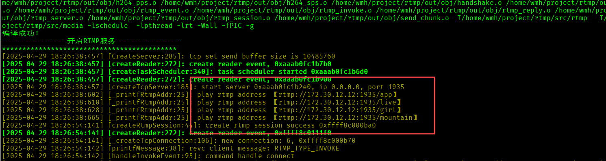
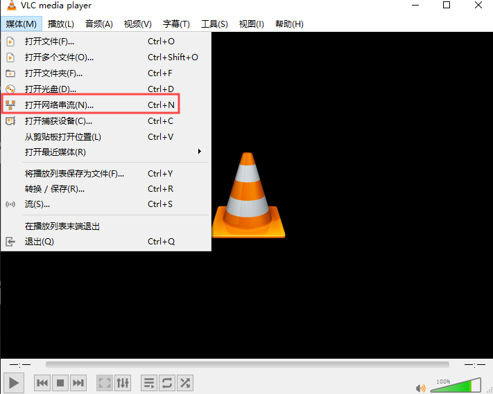
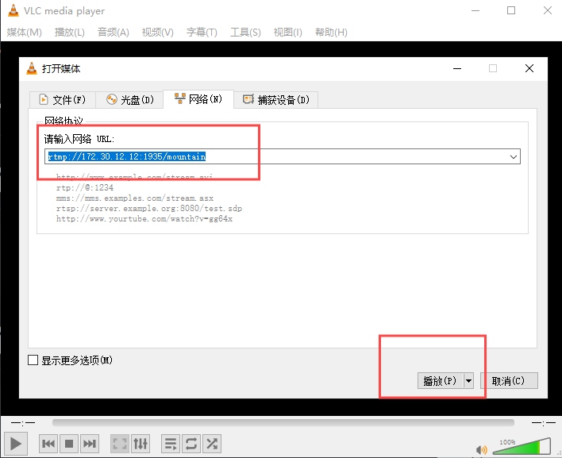
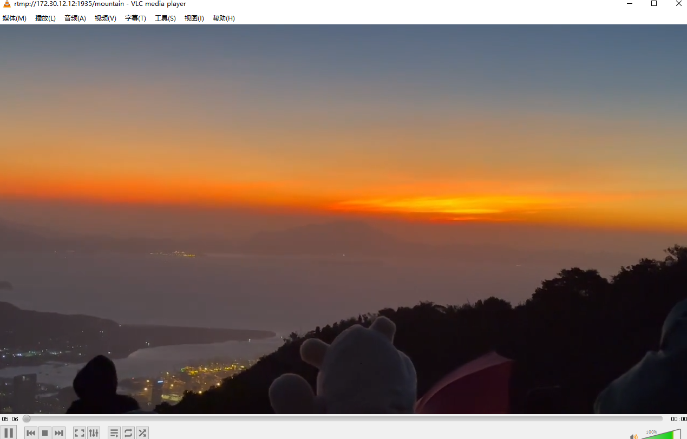

# 一个轻量型的rtmp服务器
# 运行
```
./build.sh
```

# 拉流
1. 下载VLC播放器
2. 编译的结果打印里有播放地址
3. 打开VLC, 打开媒体->打开网络串流
4. 点击播放





# 调试
```
echo "/tmp/core.%e.%p" | sudo tee /proc/sys/kernel/core_pattern

ulimit -c unlimited
```
https://rtmp.veriskope.com/docs/spec#53chunking
https://zhuanlan.zhihu.com/p/645648373


## 问题
### 1.出现send资源不可用的时候，大概率是发送缓冲满了
```
##设置TCP发送缓存区
#查看缓冲信息
sysctl net.ipv4.tcp_wmem

#设置大小
sudo sysctl -w net.ipv4.tcp_wmem="4096  87380  12582912"
sudo sysctl -w net.core.wmem_max="12582912"

#生效
sudo sysctl -p


```
